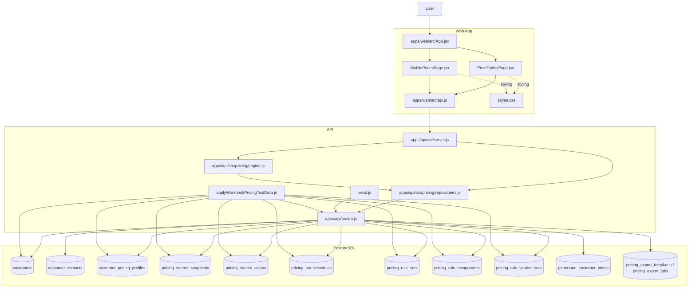

# Customer Pricing Architecture

## Mermaid Diagram

## Notes

- `Price Tables` is the admin workspace for pricing rules, inputs, previews, run history, outputs, and OPIS/source review.
- `Mobile Prices` is a mobile-first prototype using the same pricing backend and generated output records.
- `server.js` exposes the pricing HTTP routes and delegates persistence to `repositories.js` and evaluation/generation to `engine.js`.
- `engine.js` resolves the active customer profile, source snapshots, source values, taxes, and rules, then computes preview or generated outputs.
- `repositories.js` owns CRUD and query access for customers, pricing sources, taxes, rules, and generated prices.
- `db.js` creates the pricing tables and indexes during API startup or seed execution.
- `applyWorkbookPricingTestData.js` seeds deterministic pricing snapshots, values, customer profiles, taxes, and rule sets for local testing.
